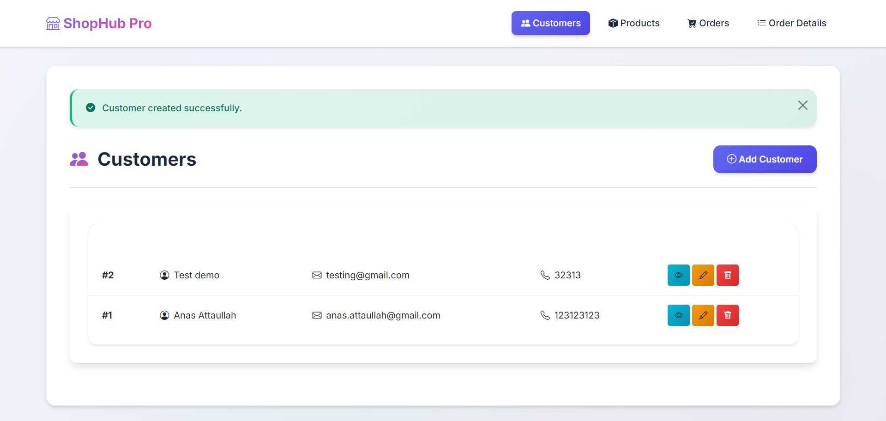
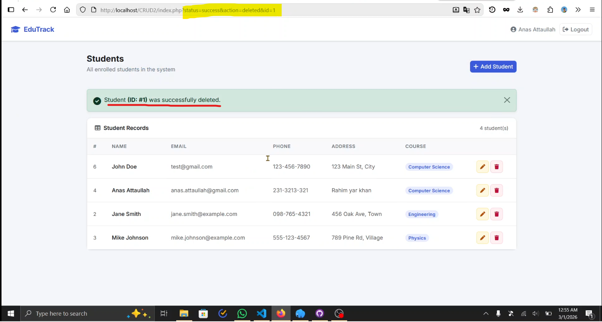
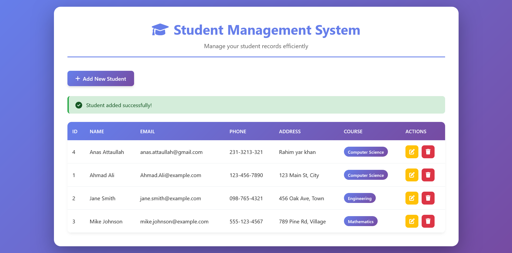
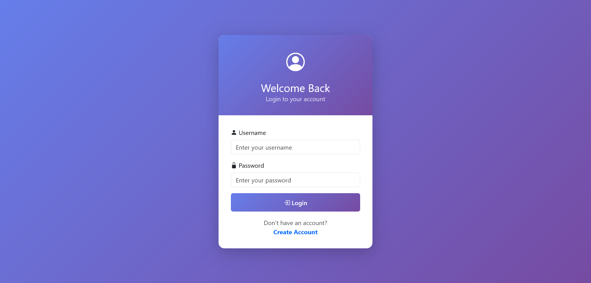
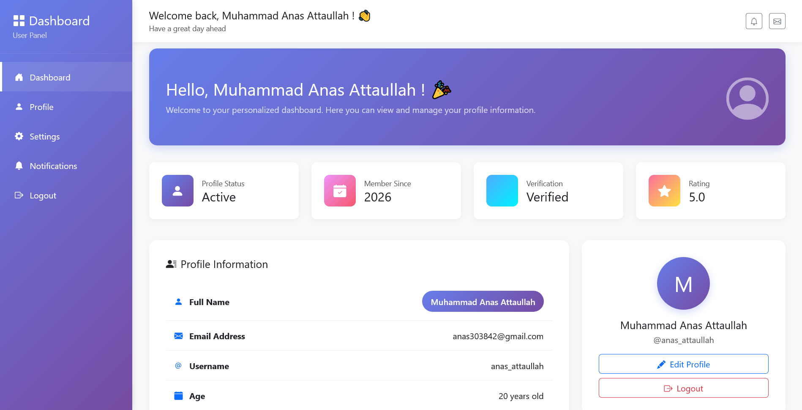

# Web Technologies Lab Projects
This repository contains the source code for the Web Technologies lab exercises.

## Lab 7 - Laravel Validation CRUD

- Improved validation safety with transaction-based stock/order updates and findOrFail on critical records.
- Added StockAdjusted event for all stock-changing actions.
- Added listeners to log stock history and low-stock alerts (stock.log, alerts.log).
- Improved the User Interface by using clean and minimal approach

## LAB 6 - Laravel CRUD 
- Complete CRUD System - Laravel 11 application managing Customers, Products, Orders, and Order Details with full create, read, update, and delete functionality.

- Relational Database - MySQL with proper foreign keys: customers have many orders, orders contain multiple order details, products link to order details, all with cascading deletes.

- Smart Inventory Management - Automatic stock tracking that decreases when orders are placed and restores when orders are deleted, plus real-time price calculations.

- Modern Minimal UI - Custom Bootstrap 5 design with gradient buttons, subtle backgrounds, responsive tables, and smooth animations—professional without looking generic.

## LAB 5 - Student CRUD  

Video Demo : [Google Drive](https://drive.google.com/file/d/1zvA6yUo9y8J8vP6JEMV5XbWwqFLqQdLk/view?usp=drive_link)
---
## LAB 4 - CRUD Application 

---
## LAB 3 - Admin Dashboard  
### Login Page

### Dashboard

## Lab 1 + 2 - E-Commerce Store 
Repository : https://github.com/AnasAttaullah/Luxe-E-Commerce-Store
